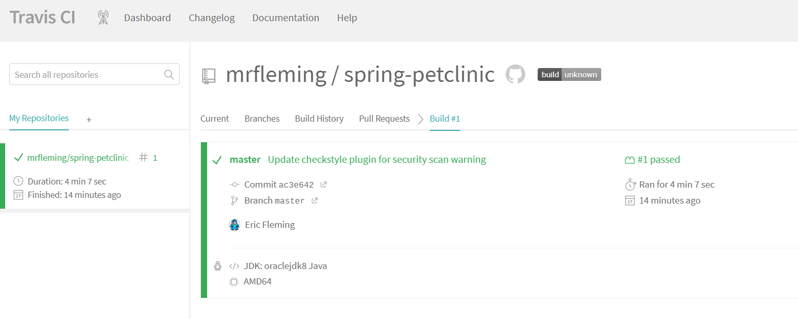

# HW5 Submission

## Deliverables
For this week, create a new SUBMISSION.md file in your repo. Add the images to a new figures
directory and add links to those images to the SUBMISSION.md file. The images you need are:

  
  

## (5 pts) Your Github account showing that is has been forked from the depaulcdm/springpetclinic repository.

 
 
 
 

## (5 pts) Your Travis CI dashboard showing a successful first build.

 
 
 
 

## (5 pts) The section of the POM file showing the coordinates after you’ve changed them.

 
 
 
 

## (5 pts) Your Travis CI dashboard showing a successful build after your change of the group
ID.

 
 
 
 

## (5 pts) The section of the POM file showing the coordinates after you’ve commented them
out.

 
 
 
 

## (5 pts) Your Travis CI dashboard showing the unsuccessful build after the breaking change.

 
 
 
 

## (5 pts) Your Github repository with the readme.md file selected showing the build failed
status after the Travis CI build fails.

 
 
 
 

## (5 pts) The section of the POM file showing the coordinates after you’ve fixed them.

 
 
 
 

## (5 pts) Your Travis CI dashboard showing the successful build after the breaking change has been fixed.

 
 
 
 

## (5 pts) Your Github repository with the readme.md file selected showing the build success status after the Travis CI build has recovered.

 
 
 
 